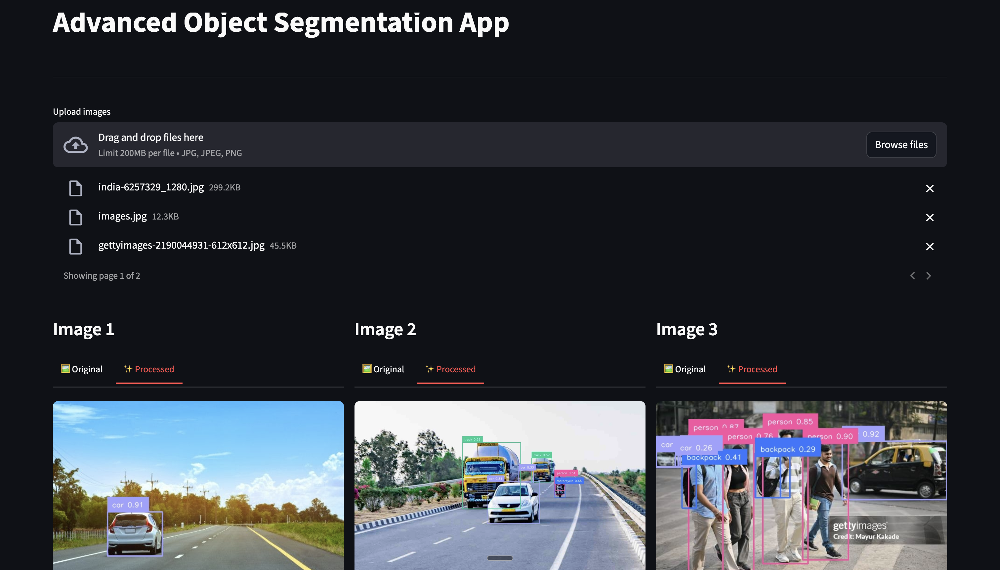
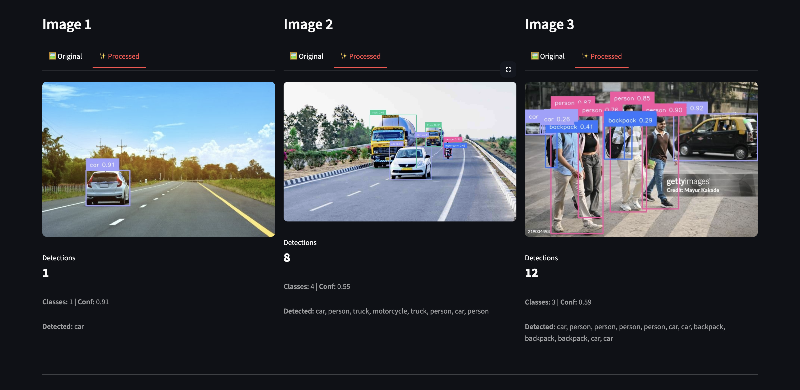
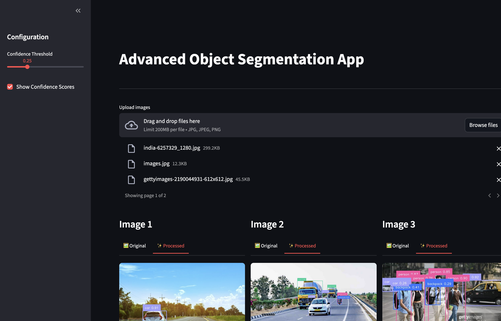

# Advanced Object Detection & Segmentation (AODS)

A powerful Streamlit web application for real-time object detection and segmentation using YOLOv8. Upload images and get instant detection results with bounding boxes, labels, and confidence scores.


## 📸 Screenshots







## 🚀 Installation

### Setup

1. **Clone the repository** (or navigate to the project directory):
   ```bash
   cd aods
   ```

2. **Install dependencies using uv** (recommended):
   ```bash
   uv sync
   ```

   Or using pip:
   ```bash
   pip install -r requirements.txt
   ```

3. **Download YOLOv8 model** (if not already present):
   The model will be automatically downloaded on first run, or you can download it manually:
   ```bash
   # The model yolov8n-seg.pt will be downloaded automatically
   ```

## 💻 Usage

### Running the Application

Using Makefile (recommended):
```bash
make dev
```

### Using the App

1. **Upload Images**: Click "Browse files" and select one or more images (JPG, JPEG, PNG)
2. **Configure Settings**: Use the sidebar to adjust:
   - **Confidence Threshold**: Set the minimum confidence for detections (0.0 - 1.0)
   - **Show Confidence Scores**: Toggle to show/hide confidence values in labels
3. **View Results**: 
   - Switch between "Original" and "Processed" tabs for each image
   - View detection statistics below each image
   - See detected objects list and class distribution

## 🛠️ Technologies Used

- **Streamlit**: Web application framework
- **Ultralytics YOLO**: State-of-the-art object detection model
- **Supervision**: Detection visualization and utilities
- **OpenCV**: Image processing
- **NumPy**: Numerical operations
- **Pandas**: Data manipulation